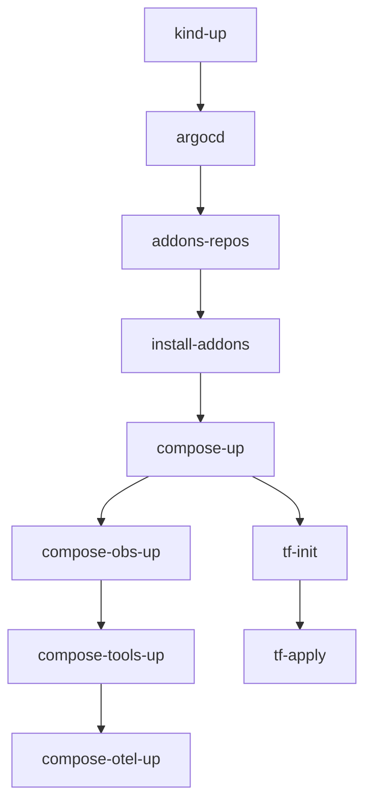

# WOS Eats - Platform Infrastructure


[](../LICENSE)


## Quick Start Guide

### Available Make Commands

#### Infrastructure Services
```bash
make compose-up         # Start base infrastructure (DB, Kafka, Keycloak, LocalStack)
make compose-obs-up     # Start base + observability stack
make compose-tools-up   # Start base + development tools
make compose-otel-up    # Start local monitoring (node-exporter, cadvisor)
make compose-collector-up # Start standalone OTel collector (when not using K8s)
make compose-full-up    # Start all services (except collector)
make compose-down       # Stop and remove all services
```

#### Kubernetes Management
```bash
make kind-up           # Create Kind cluster with Istio injection
make kind-down         # Delete Kind cluster
make addons-repos      # Add/Update Helm repositories
make install-addons    # Install K8s addons (Kong, Prometheus, Istio, KEDA, etc)
```

#### ArgoCD
```bash
make argocd           # Install ArgoCD and apply bootstrap
make argocd-port      # Access UI at https://localhost:8088
make argocd-pwd       # Get admin password
```

#### Terraform Operations
```bash
make tf-init          # Initialize Terraform
make tf-apply         # Apply Terraform configuration
make tf-destroy       # Destroy Terraform resources
```

#### Infrastructure Status
```bash
make status           # Show status of all components
make hosts-hint       # Show required /etc/hosts entries
```

#### Utility Commands
```bash
make help             # Show all available make commands with descriptions
```

### Kubernetes Components

The following components are installed via Helm charts in specific namespaces:

| Component | Namespace | Description |
|-----------|-----------|-------------|
| Kong | `kong` | API Gateway |
| Prometheus Stack | `monitoring` | Metrics & Alerting |
| Loki | `monitoring` | Log Aggregation |
| Tempo | `monitoring` | Distributed Tracing |
| KEDA | `keda` | Kubernetes Event-driven Autoscaling |
| Istio Base | `istio-system` | Service Mesh Base |
| Istiod | `istio-system` | Istio Control Plane |
| Istio Ingress | `istio-ingress` | Istio Gateway |
| ArgoCD | `argocd` | GitOps CD |

### Helm Configuration

Helm values files are located in `k8s/addons/helm-values/`:
- `kong-values.yaml` - Kong API Gateway configuration
- `prometheus-values.yaml` - Prometheus Stack settings
- `loki-values.yaml` - Loki configuration
- `tempo-values.yaml` - Tempo settings
- `keda-values.yaml` - KEDA configuration

### Prerequisites


- Docker Engine 24.x or higher
- Docker Compose V2
- kubectl 1.28+
- kind v0.20+
- Terraform 1.5+
- LocalStack Pro Token
- make
- jq (for status command)

## Component Overview

### Base Infrastructure (docker-compose.yml)
| Service | URL | Description |
|---------|-----|-------------|
| PostgreSQL | `localhost:5432` | Main database |
| Redpanda | `localhost:19092` | Kafka-compatible message broker |
| Keycloak | `localhost:8085` | Authentication server |
| LocalStack | `localhost:4566` | AWS cloud emulator |

### Observability Stack (docker-compose-observability.yml)
| Service | URL | Description |
|---------|-----|-------------|
| Prometheus | `localhost:9090` | Metrics collection |
| Grafana | `localhost:3000` | Metrics visualization |
| Loki | `localhost:3100` | Log aggregation |
| Tempo | `localhost:3200` | Distributed tracing |
| OTel Collector | `localhost:4318` | Telemetry pipeline |

### Development Tools (docker-compose-tools.yml)
| Service | URL | Description |
|---------|-----|-------------|
| pgAdmin | `localhost:5050` | PostgreSQL management UI |
| Redpanda Console | `localhost:8081` | Kafka management UI |

### Local Monitoring Stack (docker-compose-otel.yml)
| Service | URL | Description |
|---------|-----|-------------|
| Node Exporter | `localhost:9100` | Host System Metrics |
| cAdvisor | `localhost:8080` | Container Metrics |

### Standalone Collector (docker-compose-collector.yml)
| Service | URL | Description |
|---------|-----|-------------|
| OTel Collector | `localhost:4318` | OTLP HTTP Receiver |
| | `localhost:13133` | Health Check |

**Note**: The standalone collector is only used when not running in Kubernetes. When using K8s, the collector runs as part of the cluster.

## Getting Started

1. **Clone and Configure**
   ```bash
   # Set up LocalStack token in .env
   cd platform-infra/compose
   cp .env.example .env
   # Edit .env with your LocalStack Pro token
   ```

2. **Start Infrastructure**
   ```bash
   # Start everything (except collector)
   make compose-full-up
   
   # Or start specific stacks
   make compose-up         # Base services only
   make compose-obs-up     # Base + Observability
   make compose-tools-up   # Base + Development tools
   make compose-otel-up    # Add local monitoring
   
   # For local development without K8s
   make compose-collector-up # Start standalone collector
   ```

3. **Setup Kubernetes**
   ```bash
   make kind-up
   make argocd
   make install-addons
   ```

4. **Configure Local Host**
   ```bash
   make hosts-hint
   # Add to /etc/hosts:
   # 127.0.0.1 api.local
   ```

5. **Initialize AWS Services**
   ```bash
   make tf-init
   make tf-apply
   ```

## Execution Order

### 1. Initial Setup
```bash
# Clone the repository and configure environment
cd platform-infra/compose
cp .env.example .env
# Edit .env and add your LocalStack Pro token
```

### 2. Kubernetes Cluster Creation
```bash
make kind-up              # Creates Kind cluster and enables Istio injection
```

### 3. GitOps Setup
```bash
make argocd              # Installs ArgoCD and applies bootstrap configuration
make argocd-pwd          # Get the admin password
make argocd-port         # Access UI (in another terminal)
```

### 4. Kubernetes Addons Installation
```bash
make addons-repos        # Add required Helm repositories
make install-addons      # Install all K8s components in this order:
                        # 1. Kong API Gateway
                        # 2. Prometheus Stack
                        # 3. Loki
                        # 4. Tempo
                        # 5. KEDA
                        # 6. Istio (base, istiod, gateway)
```

### 5. External Services
```bash
# Start core services first
make compose-up          # Starts PostgreSQL, Redpanda, Keycloak, LocalStack

# Add observability (optional)
make compose-obs-up      # Adds Prometheus, Grafana, Loki, Tempo

# Add development tools (optional)
make compose-tools-up    # Adds pgAdmin, Redpanda Console

# Add local monitoring (optional)
make compose-otel-up     # Adds node-exporter and cAdvisor

# Or start everything at once (except collector)
make compose-full-up
```

### 6. AWS Local Infrastructure
```bash
make tf-init            # Initialize Terraform
make tf-apply          # Create AWS resources in LocalStack
```

### 7. Final Configuration
```bash
make hosts-hint        # Add required /etc/hosts entries
```

### 8. Verification
```bash
# Check all components
make status

# Verify specific endpoints
curl -s http://api.local/healthz          # API Gateway
curl -s http://localhost:4566/health      # LocalStack
```

### Dependencies



### Common Workflows

1. **Full Platform Setup**
   ```bash
   make kind-up && \
   make argocd && \
   make addons-repos && \
   make install-addons && \
   make compose-full-up && \
   make tf-init && \
   make tf-apply
   ```

2. **Minimal Development Setup**
   ```bash
   make kind-up && \
   make argocd && \
   make addons-repos && \
   make install-addons && \
   make compose-up && \
   make compose-tools-up
   ```

3. **Observability Focus**
   ```bash
   make compose-up && \
   make compose-obs-up && \
   make compose-otel-up
   ```

### Shutdown Order
```bash
# 1. Stop AWS resources
make tf-destroy

# 2. Stop Docker Compose services
make compose-down

# 3. Delete Kubernetes cluster
make kind-down
```

## Project Structure
```
platform-infra/
├── compose/                  # Docker Compose configuration
│   ├── docker-compose.yml              # Base services
│   ├── docker-compose-observability.yml # Observability stack
│   ├── docker-compose-tools.yml        # Development tools
│   ├── docker-compose-otel.yml         # Local monitoring
│   ├── docker-compose-collector.yml    # Standalone OTel collector
│   ├── .env                           # Environment configuration
│   ├── localstack/                    # LocalStack init scripts
│   └── monitoring/                    # Monitoring configuration
├── k8s/                     # Kubernetes manifests
│   ├── addons/             # Helm values for addons
│   ├── argocd/             # Argo CD configuration
│   ├── kind/               # Kind cluster config
│   └── monitoring/         # K8s monitoring setup
├── terraform/              # Infrastructure as Code
│   └── localstack/        # LocalStack AWS resources
├── Makefile               # Automation scripts
└── README.md              # This documentation

## Environment Configuration

The `.env` file contains configuration for all services:

```bash
# LocalStack
LOCALSTACK_AUTH_TOKEN=your-token-here
SERVICES=s3,sns,sqs,lambda,apigateway,elbv2

# Databases
POSTGRES_USER=postgres
POSTGRES_PASSWORD=postgres
POSTGRES_DB=wos_eats

# Development Tools
PGADMIN_DEFAULT_EMAIL=admin@admin.com
PGADMIN_DEFAULT_PASSWORD=admin

# Authentication
KEYCLOAK_ADMIN=admin
KEYCLOAK_ADMIN_PASSWORD=admin

# Monitoring
GF_SECURITY_ADMIN_USER=admin
GF_SECURITY_ADMIN_PASSWORD=admin
```

## Contributing
1. Fork the repository
2. Create your feature branch
3. Follow the project structure
4. Submit a Pull Request

## License
This project is licensed under the MIT License - see the [LICENSE](../LICENSE) file for details.
